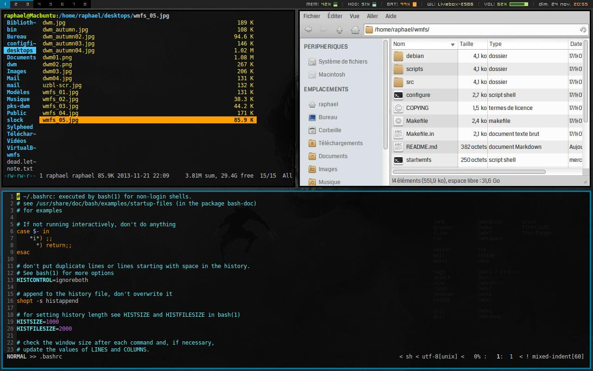

WMFS2 CONFIGURATION
-------------------

* **wmfsrc** & **wmfs__rules** are to be copied to ~/.config/wmfs/
* **wmfs.desktop** goes /urs/share/xsessions/
* **startwmfs** goes where wmfs.desktop tells him to go
* **.conkyrc** is called in the session start script. Font used: (artwiz)snap 10px
* **.Xdefaults** (see *configfiles*/): font used DejaVu Sans Mono 9pt

####Installation

    $ cd wmfs/
    $ ./configure
    $ make
    $ sudo make install

